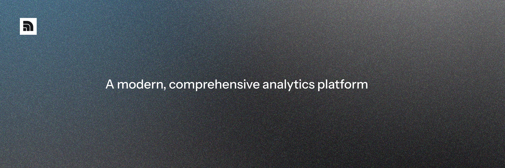

<a href="https://inflow.ibrahimraimi.com">
  
</a>

<h3 align="center">Inflow Analytics</h3>

<p align="center">
    A modern, comprehensive analytics platform
    <br />
    Read the documentation <a href="https://inflow.ibrahimraimi.com/docs"><strong>here</strong></a>
</p>

<!-- <p align="center">
  <a href="https://github.com/ibrahimraimi/inflow/actions/workflows/ci.yml">
    
  </a>
  <a href="https://github.com/ibrahimraimi/inflow/actions/workflows/docker-build.yml">
    
  </a>
</p> -->

<br/>

## Introduction

A modern, comprehensive open-source self-hosted analytics platform designed to help you collect, analyze, and understand your website data effortlessly. Now built as a high-performance monorepo for better scalability and developer experience.

## Tech Stack

- [Next.js](nextjs.org) - Framework
- [Turborepo](https://turbo.build) - Monorepo Management
- [Bun](https://bun.sh) - Runtime & Package Manager
- [TypeScript](typescriptlang.org) - Language
- [Drizzle ORM](https://orm.drizzle.team) - ORM
- [Neon PostgreSQL](https://neon.com/) - Database
- [Better Auth](https://www.better-auth.com) - Authentication
- [Tailwind](https://tailwindcss.com) - Styling
- [MailerSend](https://mailersend.com) - Email
- [Biome](https://biomejs.dev) - Linting & Formatting
- [Vercel](https://vercel.com) - Deployment

## Repository Structure

```text
.
├── apps/
│   ├── web/             # Next.js Frontend Dashboard (Port 3000)
│   └── api/             # Next.js Backend API (Port 3001)
├── packages/
│   ├── core/            # Shared server logic, services, and components
│   ├── db/              # Database schemas and Drizzle client
│   ├── types/           # Global TypeScript definitions
│   ├── sdk/             # Client-side tracking SDK
│   ├── config-typescript/ # Shared TS configurations
│   └── config-biome/    # Shared Biome configurations
└── turbo.json           # Turborepo configuration
```

## Getting Started

### Prerequisites

- Bun v1.1+ (Standardized for this workspace)
- PostgreSQL database (we recommend Neon for easy setup)
- MailerSend account for email functionality
- Google OAuth credentials (optional, for Google login)

### Installation

1. Clone the repository and install dependencies:
```bash
git clone https://github.com/ibrahimraimi/inflow.git
cd inflow
bun install
```

2. Copy the environment file and fill in required variables:
```bash
cp .env.example .env
```

3. Initialize the database:
```bash
make db-push
```

4. Start development server:
```bash
make dev
```

The applications will be available at:
- Dashboard: [http://localhost:3000](http://localhost:3000)
- API: [http://localhost:3001](http://localhost:3001)

## Available Scripts

```bash
make help        # Show all available commands
make dev         # Start all applications in development mode
make build       # Build all applications and packages
make lint        # Run linter across the workspace
make ci          # Run CI checks locally (lint, type-check, build)
make docker-up   # Start with Docker Compose
```

## License

AGPL-3.0-only

## Support

For support or questions, please contact the developer @[ibrahimraimi_](https://x.com/ibrahimraimi).
