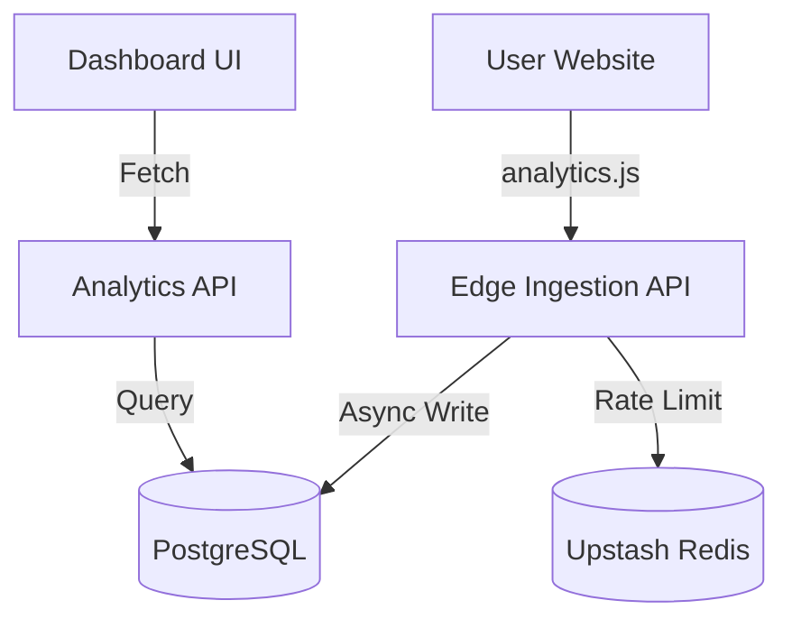

Inflow is designed as a distributed system that prioritizes low-latency data ingestion while providing a rich, interactive dashboard for data analysis.

## System Overview

## Data Lifecycle

1. **Capture**: The `analytics.js` script captures page views, referrers, and basic device info.
2. **Ingest**: Data is sent to `/api/track`. This endpoint runs on the **Edge Runtime** to minimize the distance between the user and the server.
3. **Validate**: The ingestion API validates the payload using **Zod** and checks rate limits via **Redis**.
4. **Store**: Valid events are written to the `page_views` table in PostgreSQL.
5. **Aggregate**: When a user views their dashboard, the `AnalyticsService` runs optimized SQL queries to aggregate the raw events into metrics (Visitors, Views, etc.).

## Multi-tenancy

Inflow uses a **Schema-based Multi-tenancy** model within a single database:
- Each `user` is linked to one or more `organizations`.
- `websites` are owned by an `organization`.
- All `page_views` are tagged with a `website_id`, ensuring strict data isolation at the query level.

## Scaling Strategy

- **Edge Runtime**: By running ingestion at the edge, we offload the main server and reduce user-perceived latency.
- **Connection Pooling**: We use Neon's serverless driver for efficient connection management.
- **Caching**: Future versions will implement aggregation caching in Redis to speed up dashboard loads for high-traffic sites.

---

**Next:** [Frontend Architecture](/docs/developer-guide/architecture/frontend)
